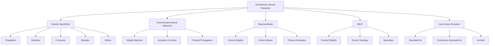
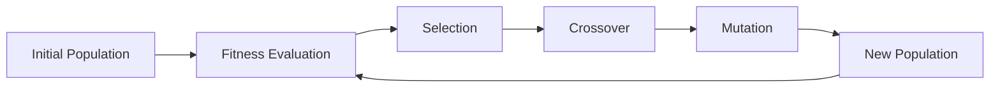

# 🧬 Evolutionary Neural Networks


A collection of small experiments combining **genetic algorithms**, **neuroevolution**, **NEAT**, and **feed-forward neural networks**.

This folder explores different ways of training or evolving neural models, including:

- A custom genetic algorithm implementation
- A simple feed-forward neural network
- Multilayer Perceptron training scripts
- NEAT-based classifiers
- Neuroevolution experiments with Iris and binary datasets
- Genetic action-sequence evolution for classic Gym/Gymnasium environments

This project is educational and experimental. The main goal is to understand how evolutionary search can interact with neural models, classifiers, and control environments.

---

## 📌 Overview

This project is part of a broader **Natural Computing** study repository.

The main goal is to experiment with how evolutionary techniques can be used to:

- Optimize neural network weights
- Evolve action sequences for reinforcement learning environments
- Train classifiers using both gradient-based and evolutionary strategies
- Compare manual genetic encoding with NEAT-style topology evolution
- Study the relationship between fitness functions, population diversity, and model performance

Evolutionary neural networks are useful because they allow neural models to be trained without relying exclusively on gradient descent. Instead of directly computing gradients, a population of candidate solutions is evaluated, selected, recombined, mutated, and improved over generations.

---

## 🖼️ Illustrative Images

### Evolutionary Algorithm Cycle


Image source: [Wikimedia Commons — Evolutionary Algorithm.svg](https://commons.wikimedia.org/wiki/File:Evolutionary_Algorithm.svg)

---

### Genetic Algorithm Crossover


Image source: [Wikimedia Commons — One Point Crossover.svg](https://commons.wikimedia.org/wiki/File:Computational.science.Genetic.algorithm.Crossover.One.Point.svg)

---

### Artificial Neural Network


Image source: [Wikimedia Commons — Artificial neural network.svg](https://commons.wikimedia.org/wiki/File:Artificial_neural_network.svg)

---

## 🧭 Conceptual Map



---

## 🧠 Main Concepts

This folder covers:

- **Genetic Algorithms**
- **Neuroevolution**
- **Feed-forward Neural Networks**
- **Multilayer Perceptrons**
- **NEAT**
- **Binary Classification**
- **Iris Classification**
- **Gym/Gymnasium Environment Optimization**
- **Chromosome Encoding**
- **Fitness-based Search**
- **Evolutionary Optimization**

---

## 📁 Folder Structure

```text
Evolutionary_Neural_Networks/
├── binary_admission_dataset.txt
├── three_feature_binary_dataset.txt
├── iris_train_dataset.txt
├── iris_test_dataset.txt
│
├── genetic_algorithm.py
├── feedforward_neural_network.py
├── neat_visualization.py
│
├── train_mlp_binary_classifier.py
├── train_mlp_iris_classifier.py
│
├── train_neat_binary_classifier.py
├── train_neat_iris_classifier.py
├── train_neat_iris_one_hot_classifier.py
│
├── neuroevolution_binary_classifier.py
├── neuroevolution_three_feature_classifier.py
├── neuroevolution_iris_classifier.py
├── neuroevolution_genetic_algorithm_demo.py
│
├── test_neuroevolution_encoding.py
│
├── evolve_mountain_car_actions.py
├── evolve_continuous_mountain_car_actions.py
├── evolve_acrobot_actions.py
│
├── neat_binary_classifier_config
├── neat_iris_classifier_config
│
└── mountain_car_genetic_algorithm_demo.m4v
```

---

## 🧩 Core Modules

### `genetic_algorithm.py`

Implements the custom genetic algorithm engine.

It includes:

- `Gene`
- `Chromosome`
- `GeneticMachine`
- Tournament selection
- Roulette selection
- Elitism
- Mutation
- Crossover
- Neural chromosome encoding

This module is used by the neuroevolution and Gym action-evolution experiments.

---

### `feedforward_neural_network.py`

Implements a simple feed-forward neural network.

It includes:

- Weight matrix initialization
- Random network creation
- Layer activation
- Transfer function using `tanh`
- Full feed-forward execution

This module is used in the custom neuroevolution scripts, where chromosomes encode neural network weights.

---

### `neat_visualization.py`

Utility module for visualizing NEAT experiments.

It can generate:

- Fitness evolution plots
- Species evolution plots
- Neural network topology diagrams using Graphviz

---

## 🧮 Mathematical Background

### 1. Genetic Algorithm

A genetic algorithm works with a population of candidate solutions:

$$
P = \{c_1, c_2, \dots, c_n\}
$$

Each candidate solution is represented as a chromosome:

$$
c = [g_1, g_2, \dots, g_m]
$$

where each $g_i$ is a gene.

The objective is to find the chromosome that maximizes a fitness function:

$$
c^* = \arg\max_{c \in P} f(c)
$$

where:

- $P$ is the population
- $c$ is a chromosome
- $f(c)$ is the fitness function
- $c^*$ is the best chromosome found

The basic evolutionary loop is:



---

### 2. Feed-forward Neural Network

For a neural network layer $l$, the forward pass can be written as:

$$
a^{(l)} = \sigma\left(W^{(l)}a^{(l-1)} + b^{(l)}\right)
$$

where:

- $a^{(l)}$ is the activation vector of layer $l$
- $W^{(l)}$ is the weight matrix of layer $l$
- $b^{(l)}$ is the bias vector
- $\sigma$ is the activation function

For a network with layer sizes:

$$
L_0, L_1, L_2, \dots, L_n
$$

the number of weights is approximately:

$$
W_{\text{total}} = \sum_{i=0}^{n-1} L_iL_{i+1}
$$

---

### 3. Neuroevolution

In neuroevolution, a genetic algorithm evolves the parameters or structure of a neural network.

A chromosome may encode network weights as:

$$
c = [w_1, w_2, \dots, w_k]
$$

or weights and biases as:

$$
c = [w_1, w_2, \dots, w_k, b_1, b_2, \dots, b_j]
$$

The neural network is decoded from the chromosome, evaluated on a task, and assigned a fitness score.

For classification, the fitness can be defined as accuracy:

$$
f(c) = \frac{\text{correct predictions}}{\text{total samples}}
$$

For reinforcement learning or control tasks, the fitness can be defined as accumulated reward:

$$
f(c) = \sum_{t=0}^{T} r_t
$$

where $r_t$ is the reward at time step $t$.

---

### 4. NEAT

**NEAT** stands for **NeuroEvolution of Augmenting Topologies**.

Unlike fixed-topology neuroevolution, NEAT evolves both:

- Neural network weights
- Neural network topology

A NEAT genome can change through structural mutations such as:

- Adding a new connection
- Adding a new node
- Mutating connection weights
- Enabling or disabling genes

A simplified compatibility distance between two genomes can be written as:

$$
\delta =
\frac{c_1E}{N}
+
\frac{c_2D}{N}
+
c_3\overline{W}
$$

where:

- $E$ is the number of excess genes
- $D$ is the number of disjoint genes
- $\overline{W}$ is the average weight difference
- $N$ normalizes genome size
- $c_1$, $c_2$, and $c_3$ are coefficients

This compatibility distance is used to group genomes into species and preserve population diversity.

---

## 📊 Datasets

### `binary_admission_dataset.txt`

Binary classification dataset with two input features and one output class.

Format:

```text
feature_1,feature_2,class
```

Example:

```text
34.62365962451697,78.0246928153624,0
60.18259938620976,86.30855209546826,1
```

Used by:

```text
train_mlp_binary_classifier.py
neuroevolution_binary_classifier.py
train_neat_binary_classifier.py
```

---

### `three_feature_binary_dataset.txt`

Binary classification dataset with three input features.

Used by:

```text
neuroevolution_three_feature_classifier.py
```

---

### `iris_train_dataset.txt`

Training dataset for Iris classification experiments.

Used by:

```text
train_mlp_iris_classifier.py
train_neat_iris_classifier.py
train_neat_iris_one_hot_classifier.py
neuroevolution_iris_classifier.py
```

---

### `iris_test_dataset.txt`

Test dataset for Iris classification experiments.

Used by:

```text
train_mlp_iris_classifier.py
neuroevolution_iris_classifier.py
```

---

## ⚙️ Configuration Files

### `neat_binary_classifier_config`

NEAT configuration for binary classification.

Expected network structure:

```text
num_inputs  = 2
num_outputs = 1
```

Used by:

```text
train_neat_binary_classifier.py
```

---

### `neat_iris_classifier_config`

NEAT configuration for Iris classification.

Expected network structure depends on the script.

For two-output encoding:

```text
num_inputs  = 4
num_outputs = 2
```

For one-hot encoding:

```text
num_inputs  = 4
num_outputs = 3
```

Used by:

```text
train_neat_iris_classifier.py
train_neat_iris_one_hot_classifier.py
```

---

## 🚀 How to Run

From the repository root:

```bash
python Evolutionary_Neural_Networks/train_mlp_binary_classifier.py
```

```bash
python Evolutionary_Neural_Networks/train_mlp_iris_classifier.py
```

```bash
python Evolutionary_Neural_Networks/train_neat_binary_classifier.py
```

```bash
python Evolutionary_Neural_Networks/train_neat_iris_classifier.py
```

```bash
python Evolutionary_Neural_Networks/neuroevolution_binary_classifier.py
```

```bash
python Evolutionary_Neural_Networks/evolve_mountain_car_actions.py
```

On Windows, you can also use:

```powershell
py Evolutionary_Neural_Networks/train_mlp_binary_classifier.py
py Evolutionary_Neural_Networks/train_neat_iris_classifier.py
py Evolutionary_Neural_Networks/evolve_mountain_car_actions.py
```

---

## 📦 Requirements

Install the main dependencies:

```bash
pip install numpy matplotlib neat-python graphviz gymnasium
```

If your scripts still use the older `gym` package, install:

```bash
pip install gym
```

For Gymnasium classic control environments, you may need:

```bash
pip install "gymnasium[classic-control]"
```

Graphviz may also require a system installation.

On Windows, install Graphviz and make sure its `bin` folder is available in the system `PATH`.

---

## 🧪 Experiments

### MLP Experiments

| Script | Description |
|---|---|
| `train_mlp_binary_classifier.py` | Trains a multilayer perceptron on the binary admission dataset |
| `train_mlp_iris_classifier.py` | Trains a multilayer perceptron on the Iris dataset |

---

### NEAT Experiments

| Script | Description |
|---|---|
| `train_neat_binary_classifier.py` | Uses NEAT for binary classification |
| `train_neat_iris_classifier.py` | Uses NEAT for Iris classification with compact encoding |
| `train_neat_iris_one_hot_classifier.py` | Uses NEAT for Iris classification with one-hot encoding |

---

### Custom Neuroevolution Experiments

| Script | Description |
|---|---|
| `neuroevolution_binary_classifier.py` | Evolves feed-forward network weights for binary classification |
| `neuroevolution_three_feature_classifier.py` | Evolves network weights for a three-feature binary dataset |
| `neuroevolution_iris_classifier.py` | Evolves network weights for Iris classification |
| `neuroevolution_genetic_algorithm_demo.py` | Demonstrates custom genetic algorithm behavior |
| `test_neuroevolution_encoding.py` | Tests neural chromosome encoding and decoding |

---

### Gym/Gymnasium Action Evolution

| Script | Environment | Description |
|---|---|---|
| `evolve_mountain_car_actions.py` | `MountainCar-v0` | Evolves discrete action sequences |
| `evolve_continuous_mountain_car_actions.py` | `MountainCarContinuous-v0` | Evolves continuous action sequences |
| `evolve_acrobot_actions.py` | `Acrobot-v1` | Evolves action sequences for Acrobot |

In these experiments, the chromosome may encode a sequence of actions instead of neural network weights.

For example:

$$
c = [a_0, a_1, a_2, \dots, a_T]
$$

where $a_t$ is the action selected at time step $t$.

The fitness is usually the accumulated reward:

$$
R = \sum_{t=0}^{T} r_t
$$

---

## ⏱️ Complexity Overview

### Feed-forward Neural Network

For a network with layer sizes:

$$
L_0, L_1, L_2, \dots, L_n
$$

the feed-forward cost is approximately:

$$
O\left(\sum_{i=0}^{n-1} L_iL_{i+1}\right)
$$

The memory usage for weights is also:

$$
O\left(\sum_{i=0}^{n-1} L_iL_{i+1}\right)
$$

---

### Genetic Algorithm

For:

```text
P = population size
C = chromosome length
G = number of generations
```

the approximate evolutionary cost is:

$$
O(G \cdot P \cdot C)
$$

This does not include the cost of evaluating each chromosome in the environment or dataset.

---

### Neuroevolution

For:

```text
P = population size
C = chromosome length
N = number of samples
G = number of generations
```

the approximate cost is:

$$
O(G \cdot P \cdot N \cdot C)
$$

This is usually more expensive than direct supervised training because every chromosome must be evaluated over multiple samples.

---

### NEAT

NEAT complexity depends on:

- Population size
- Number of generations
- Number of species
- Number of nodes and connections per genome
- Dataset size

A simplified view is:

$$
O(G \cdot P \cdot N \cdot E)
$$

where:

```text
G = generations
P = population size
N = number of samples
E = average number of enabled connections
```

Since NEAT evolves topology, $E$ may change during evolution.

---

### Gym/Gymnasium Action Evolution

For:

```text
G = generations
P = population size
T = episode length
C = chromosome length
```

the approximate cost is:

$$
O(G \cdot P \cdot T)
$$

If the action sequence length is equal to the episode length, then:

$$
C \approx T
$$

and the cost can be interpreted as:

$$
O(G \cdot P \cdot C)
$$

The real cost also depends on environment simulation time.

---

## 📊 Complexity Summary

| Method | Main Cost | Approximate Time Complexity | Approximate Space Complexity |
|---|---|---:|---:|
| Feed-forward network | Matrix/vector operations | $O(\sum L_iL_{i+1})$ | $O(\sum L_iL_{i+1})$ |
| Genetic algorithm | Population evolution | $O(GPC)$ | $O(PC)$ |
| Neuroevolution | Fitness over dataset | $O(GPNC)$ | $O(PC)$ |
| NEAT | Evolving graph evaluation | $O(GPNE)$ | $O(PE)$ |
| Gym action evolution | Environment simulation | $O(GPT)$ | $O(PC)$ |

Where:

```text
G = number of generations
P = population size
N = number of samples
C = chromosome length
T = episode length
E = average enabled connections
L_i = number of neurons in layer i
```

---

## 📈 Outputs

Some scripts generate visual outputs such as:

- Fitness plots
- Species evolution plots
- Network topology graphs
- Environment renderings
- Training progress in the terminal

Graph files such as `Digraph.gv` may be generated automatically by Graphviz when using NEAT visualization utilities.

The included video file:

```text
mountain_car_genetic_algorithm_demo.m4v
```

can be used to demonstrate the behavior of an evolved action sequence in the MountainCar environment.

---

## 🧰 Related Libraries

### Python

| Library | Purpose |
|---|---|
| `numpy` | Matrix operations, numerical computing, neural weights |
| `matplotlib` | Plotting fitness curves and results |
| `neat-python` | NEAT implementation for evolving neural networks |
| `graphviz` | Network topology visualization |
| `gymnasium` | Modern maintained environments for reinforcement learning experiments |
| `gym` | Older Gym API used by legacy examples |
| `scikit-learn` | Optional metrics and comparison models |
| `pandas` | Optional dataset loading and preprocessing |
| `deap` | Evolutionary computation framework |
| `pygad` | Genetic algorithm library |

---

### C++ and Other Languages

Although this project is written in Python, similar ideas can be implemented in other programming ecosystems.

| Language | Library / Framework | Purpose |
|---|---|---|
| C++ | Eigen | Linear algebra and matrix operations |
| C++ | Armadillo | Scientific computing and matrix-based algorithms |
| C++ | mlpack | Machine learning algorithms in C++ |
| C++ | dlib | Machine learning and numerical optimization |
| C++ | pagmo2 | Parallel optimization and metaheuristics |
| Java | Deep Java Library | Deep learning in Java |
| Java | Smile | Machine learning algorithms for Java and Scala |
| JavaScript | TensorFlow.js | Neural networks and ML in JavaScript |
| Julia | Flux.jl | Neural networks and differentiable programming |
| Rust | Linfa | Machine learning toolkit inspired by scikit-learn |

---

## 🧠 Notes

Some experiments use older exploratory implementations and may require small adjustments depending on:

- File paths
- Dataset names
- NEAT config names
- Gym or Gymnasium version
- Graphviz installation
- Class and method names after refactoring

The project is educational and experimental. The main purpose is to study how evolutionary methods can interact with neural models and decision-making environments.

---

## 🧭 Future Improvements

Possible improvements:

- Add `requirements.txt`
- Add `__init__.py`
- Move datasets into a `data/` folder
- Move experiments into an `experiments/` folder
- Add random seed control
- Add train/test metrics tables
- Add confusion matrices
- Add precision, recall, and F1-score
- Add reward plots for Gym/Gymnasium experiments
- Save best genome/chromosome after training
- Add command-line arguments for population size and generations
- Add comparison against scikit-learn MLP models
- Add notebooks explaining each experiment
- Add tests for chromosome encoding and decoding
- Add documentation for all classes and methods

Recommended future structure:

```text
Evolutionary_Neural_Networks/
├── data/
│   ├── binary/
│   └── iris/
│
├── evolutionary_neural_networks/
│   ├── __init__.py
│   ├── genetic_algorithm.py
│   ├── feedforward_neural_network.py
│   ├── neat_visualization.py
│   └── encoding.py
│
├── experiments/
│   ├── classification/
│   ├── neat/
│   └── control/
│
├── configs/
│   ├── neat_binary_classifier_config
│   └── neat_iris_classifier_config
│
├── docs/
│   └── images/
│
├── tests/
├── requirements.txt
└── README.md
```

---

## 🖼️ Image Credits and Licenses

| Image | Author / Source | License | Link |
|---|---|---|---|
| Evolutionary Algorithm | Jorge.maturana / Wikimedia Commons | CC BY 3.0 | [File page](https://commons.wikimedia.org/wiki/File:Evolutionary_Algorithm.svg) |
| One-point Crossover | Josep Panadero / Wikimedia Commons | GFDL or CC BY-SA 3.0 | [File page](https://commons.wikimedia.org/wiki/File:Computational.science.Genetic.algorithm.Crossover.One.Point.svg) |
| Artificial Neural Network | Cburnett / Wikimedia Commons | GFDL or CC BY-SA 3.0 | [File page](https://commons.wikimedia.org/wiki/File:Artificial_neural_network.svg) |

---

## 📚 References

| Topic | Reference | Type | Link |
|---|---|---|---|
| NEAT | Kenneth O. Stanley and Risto Miikkulainen — *Evolving Neural Networks through Augmenting Topologies* | Paper | [Official PDF](https://nn.cs.utexas.edu/downloads/papers/stanley.ec02.pdf) |
| NEAT | NEAT-Python documentation | Documentation | [Read the Docs](https://neat-python.readthedocs.io/) |
| Evolutionary Computation | Melanie Mitchell — *An Introduction to Genetic Algorithms* | Book | [MIT Press](https://mitpress.mit.edu/9780262631853/an-introduction-to-genetic-algorithms/) |
| Genetic Algorithms | David E. Goldberg — *Genetic Algorithms in Search, Optimization, and Machine Learning* | Book | [WorldCat](https://search.worldcat.org/title/Genetic-algorithms-in-search-optimization-and-machine-learning/oclc/17674450) |
| Artificial Intelligence | Stuart Russell and Peter Norvig — *Artificial Intelligence: A Modern Approach* | Book | [Official AIMA website](https://aima.cs.berkeley.edu/) |
| Neuroevolution | Risto Miikkulainen et al. — *Evolving Deep Neural Networks* | Paper | [arXiv](https://arxiv.org/abs/1703.00548) |
| Datasets | UCI Machine Learning Repository — Iris Dataset | Dataset | [UCI Iris](https://archive.ics.uci.edu/dataset/53/iris) |
| RL Environments | Gymnasium Classic Control | Documentation | [Gymnasium](https://gymnasium.farama.org/environments/classic_control/) |
| Legacy RL Environments | OpenAI Gym / Gym Library | Documentation | [Gym](https://www.gymlibrary.dev/) |
| Numerical Computing | NumPy | Python Library | [NumPy Docs](https://numpy.org/doc/) |
| Plotting | Matplotlib | Python Library | [Matplotlib Docs](https://matplotlib.org/stable/) |
| Graph Visualization | Graphviz | Tool | [Graphviz](https://graphviz.org/) |
| Evolutionary Computation | DEAP | Python Library | [DEAP Docs](https://deap.readthedocs.io/) |
| Genetic Algorithms | PyGAD | Python Library | [PyGAD Docs](https://pygad.readthedocs.io/en/latest/) |
| Machine Learning | scikit-learn | Python Library | [scikit-learn](https://scikit-learn.org/stable/) |
| C++ Linear Algebra | Eigen | C++ Library | [Eigen](https://libeigen.gitlab.io/) |
| C++ Scientific Computing | Armadillo | C++ Library | [Armadillo](https://arma.sourceforge.net/) |
| C++ Machine Learning | mlpack | C++ Library | [mlpack](https://www.mlpack.org/) |
| C++ Machine Learning | dlib | C++ Library | [dlib](https://dlib.net/) |
| Parallel Optimization | pagmo2 | C++ Library | [pagmo2](https://esa.github.io/pagmo2/) |
| Java Deep Learning | Deep Java Library | Java Library | [DJL](https://djl.ai/) |
| JavaScript ML | TensorFlow.js | JavaScript Library | [TensorFlow.js](https://www.tensorflow.org/js) |
| Julia ML | Flux.jl | Julia Library | [Flux](https://fluxml.ai/) |
| Rust ML | Linfa | Rust Library | [Linfa](https://github.com/rust-ml/linfa) |

---

## 📄 License

This project is available for educational and study purposes.

---

## ✅ Summary

This folder is a practical study space for understanding how neural networks and evolutionary algorithms can work together.

It connects:

```text
genetic algorithms
neural networks
fitness functions
classification
control environments
NEAT
neuroevolution
```

The main emphasis is:

```text
Encode a solution.
Evaluate its behavior.
Select the best candidates.
Mutate and recombine.
Repeat until better behavior emerges.
```
