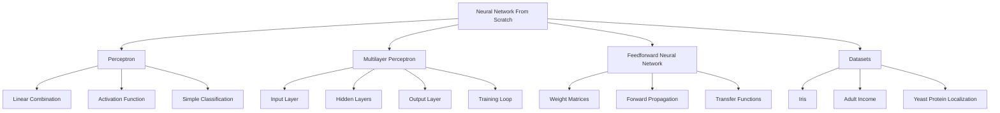
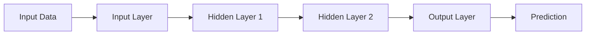

# 🧠 Neural Network From Scratch


Educational implementation of basic **neural networks from scratch** using **Python**, **NumPy**, and **Matplotlib**.

This project was created to study the internal mechanics of neural networks without relying on high-level machine learning frameworks such as TensorFlow, PyTorch, Keras, JAX, or scikit-learn.

The focus is on understanding how neural networks work at a lower level, including weight matrices, activation functions, forward propagation, simple training loops, manual preprocessing, and dataset-specific target encoding.

---

## 📌 Overview

Neural networks are computational models inspired by the way biological nervous systems process information.

At a basic level, a neural network receives input data, combines it with trainable weights, applies activation functions, and produces an output. During training, the network adjusts its internal parameters to improve its predictions.

This repository includes educational experiments related to:

* Single-layer perceptrons
* Multilayer perceptrons
* Feedforward neural networks
* Iris flower classification
* Adult Income classification
* Yeast protein localization classification
* Manual dataset preprocessing
* Manual class encoding
* Basic training and evaluation loops

The main goal is not to build a production-ready machine learning library. The goal is to make the internal logic visible and easier to understand.

---

## 🖼️ Illustrative Images

### Perceptron Model


Image source: [Wikimedia Commons — Perceptron.svg](https://commons.wikimedia.org/wiki/File:Perceptron.svg)

---

### Artificial Neural Network


Image source: [Wikimedia Commons — Artificial neural network.svg](https://commons.wikimedia.org/wiki/File:Artificial_neural_network.svg)

---

### Iris Dataset Scatterplot


Image source: [Wikimedia Commons — Iris dataset scatterplot.svg](https://commons.wikimedia.org/wiki/File:Iris_dataset_scatterplot.svg)

---

## 🧭 Conceptual Map



---

## 📂 Repository Structure

```text
Neural_Network/
│
├── adult_income_mlp_training.py
├── adult_income_train.txt
├── adult_income_test.txt
│
├── feedforward_neural_network.py
│
├── iris_single_layer_perceptron_training.py
├── iris_train.txt
├── iris_evaluation.txt
│
├── perceptron_implementation.py
│
├── yeast_protein_localization_mlp_training.py
├── yeast_protein_localization.txt
│
└── README.md
```

---

## ✅ Main Files

| File                                         | Description                                                           |
| -------------------------------------------- | --------------------------------------------------------------------- |
| `perceptron_implementation.py`               | Contains the single-layer and multilayer perceptron implementations.  |
| `feedforward_neural_network.py`              | Simple feedforward neural network focused on forward propagation.     |
| `iris_single_layer_perceptron_training.py`   | Trains and evaluates a single-layer perceptron on the Iris dataset.   |
| `adult_income_mlp_training.py`               | Trains and tests a multilayer perceptron on the Adult Income dataset. |
| `yeast_protein_localization_mlp_training.py` | Trains and tests a multilayer perceptron on the Yeast dataset.        |

---

## 🧠 What This Project Studies

This repository explores the basic building blocks behind neural networks.

Main concepts:

```text
weight matrices
bias values
activation functions
transfer functions
forward propagation
classification
training loops
dataset preprocessing
target encoding
manual evaluation
```

The project intentionally avoids high-level abstractions in order to make each step easier to inspect.

---

## 🧮 Mathematical Background

### 1. Artificial Neuron

A basic artificial neuron computes a weighted sum of its inputs:

$$
z = w^T x + b
$$

where:

* $x$ is the input vector
* $w$ is the weight vector
* $b$ is the bias
* $z$ is the pre-activation value

The neuron output is then computed using an activation function:

$$
\hat{y} = \phi(z)
$$

where $\phi$ may be a step function, sigmoid, hyperbolic tangent, or another nonlinear function.

---

### 2. Single-layer Perceptron

For an input vector:

$$
x = [x_1, x_2, \dots, x_m]
$$

and an output layer with $o$ output neurons, the perceptron computes:

$$
y = \phi(Wx + b)
$$

where:

* $W \in \mathbb{R}^{o \times m}$
* $x \in \mathbb{R}^{m}$
* $b \in \mathbb{R}^{o}$
* $y \in \mathbb{R}^{o}$

A simple binary step activation can be written as:

$$
\phi(z) =
\begin{cases}
1, & z \geq 0 \
0, & z < 0
\end{cases}
$$

---

### 3. Multilayer Perceptron

A multilayer perceptron extends the perceptron by adding one or more hidden layers.

For layer $l$, the computation is:

$$
a^{(l)} = \sigma\left(W^{(l)}a^{(l-1)} + b^{(l)}\right)
$$

where:

* $a^{(l)}$ is the activation of layer $l$
* $W^{(l)}$ is the weight matrix of layer $l$
* $b^{(l)}$ is the bias vector of layer $l$
* $\sigma$ is the activation function

For a network with layer sizes:

$$
L_0, L_1, L_2, \dots, L_n
$$

the total number of weights is approximately:

$$
W_{\text{total}} = \sum_{i=0}^{n-1} L_iL_{i+1}
$$

---

### 4. Forward Propagation

Forward propagation is the process of passing input data through the network until the output layer is reached.



In simplified form:

$$
x \rightarrow a^{(1)} \rightarrow a^{(2)} \rightarrow \dots \rightarrow \hat{y}
$$

The output $\hat{y}$ is then compared with the expected target $y$.

---

## 🌸 Iris Classification

The Iris experiment uses a **single-layer perceptron** to classify flower species.

Dataset files:

```text
iris_train.txt
iris_evaluation.txt
```

Input features:

```text
sepal length
sepal width
petal length
petal width
```

Target encoding:

| Class             |       Target |
| ----------------- | -----------: |
| `Iris-setosa`     | `[0.0, 0.0]` |
| `Iris-versicolor` | `[0.0, 1.0]` |
| `Iris-virginica`  | `[1.0, 1.0]` |

Run:

```bash
python iris_single_layer_perceptron_training.py
```

On Windows:

```powershell
py iris_single_layer_perceptron_training.py
```

---

## 👤 Adult Income Classification

The Adult Income experiment uses a **multilayer perceptron** to classify income groups.

Dataset files:

```text
adult_income_train.txt
adult_income_test.txt
```

Input features include:

```text
age
workclass
education
marital status
occupation
relationship
race
sex
capital gain
capital loss
hours per week
native country
```

Target encoding:

| Class   |  Target |
| ------- | ------: |
| `>50K`  | `[0.0]` |
| `<=50K` | `[1.0]` |

Run:

```bash
python adult_income_mlp_training.py
```

On Windows:

```powershell
py adult_income_mlp_training.py
```

---

## 🧬 Yeast Protein Localization

The Yeast experiment uses a **multilayer perceptron** to classify protein localization sites.

Dataset file:

```text
yeast_protein_localization.txt
```

Input:

```text
8 numeric biological features
```

Output:

```text
4-value encoded protein localization class
```

Run:

```bash
python yeast_protein_localization_mlp_training.py
```

On Windows:

```powershell
py yeast_protein_localization_mlp_training.py
```

---

## 🧰 Dependencies

Install the dependencies:

```bash
pip install numpy matplotlib
```

Optional libraries for comparison, evaluation, and future improvements:

```bash
pip install pandas scikit-learn seaborn
```

Current main dependencies:

| Library        | Purpose                                                          |
| -------------- | ---------------------------------------------------------------- |
| `numpy`        | Vector operations, matrices, numerical computation, dot products |
| `matplotlib`   | Plotting results, visualizing experiments, training curves       |
| `pandas`       | Optional dataset loading and preprocessing                       |
| `scikit-learn` | Optional comparison with standard ML models and metrics          |
| `seaborn`      | Optional statistical visualization                               |

---

## 🧪 Related Libraries in Other Languages

Although this project is implemented in Python, similar neural network and numerical computing ideas can also be explored in other languages.

| Language   | Library / Framework | Purpose                                                  |
| ---------- | ------------------- | -------------------------------------------------------- |
| C++        | Eigen               | Linear algebra, matrices, vectors                        |
| C++        | Armadillo           | Scientific computing and matrix operations               |
| C++        | dlib                | Machine learning, optimization, and numerical tools      |
| C++        | mlpack              | Machine learning algorithms in C++                       |
| Java       | Deep Java Library   | Deep learning in Java                                    |
| Java       | Smile               | Machine learning, classification, clustering, regression |
| JavaScript | TensorFlow.js       | Machine learning and neural networks in JavaScript       |
| JavaScript | ml5.js              | Friendly ML library built on top of TensorFlow.js        |
| Julia      | Flux.jl             | Neural networks and differentiable programming           |
| Julia      | MLJ.jl              | Machine learning workflows                               |
| Rust       | ndarray             | N-dimensional arrays and numerical computing             |
| Rust       | Linfa               | Machine learning toolkit inspired by scikit-learn        |

---

## 🧮 Model Summary

| Model                   | File                            | Main Use                              |
| ----------------------- | ------------------------------- | ------------------------------------- |
| Single-layer perceptron | `perceptron_implementation.py`  | Iris classification                   |
| Multilayer perceptron   | `perceptron_implementation.py`  | Adult Income and Yeast classification |
| Feedforward network     | `feedforward_neural_network.py` | Study of forward propagation          |

---

## 📈 Complexity Overview

This section summarizes the approximate computational complexity of the main models and scripts.

Let:

```text
N = number of samples
E = number of epochs
m = number of input features
h = number of hidden neurons per hidden layer
L = number of hidden layers
o = number of output neurons
W = total number of weights in the network
```

---

### Model Complexity

| Model                   |   Forward Pass | Training per Sample |                  Full Training |          Space |
| ----------------------- | -------------: | ------------------: | -----------------------------: | -------------: |
| Single-layer perceptron | $O(m \cdot o)$ |      $O(m \cdot o)$ | $O(E \cdot N \cdot m \cdot o)$ | $O(m \cdot o)$ |
| Feedforward network     |         $O(W)$ |     Not implemented |                Not implemented |         $O(W)$ |
| Multilayer perceptron   |         $O(W)$ |              $O(W)$ |         $O(E \cdot N \cdot W)$ |         $O(W)$ |

---

### Script Complexity

| Script                                       | Main Cost                            |         Approximate Complexity |
| -------------------------------------------- | ------------------------------------ | -----------------------------: |
| `iris_single_layer_perceptron_training.py`   | Training a single-layer perceptron   | $O(E \cdot N \cdot m \cdot o)$ |
| `adult_income_mlp_training.py`               | Training an MLP on Adult Income data |         $O(E \cdot N \cdot W)$ |
| `yeast_protein_localization_mlp_training.py` | Training an MLP on Yeast data        |         $O(E \cdot N \cdot W)$ |
| `feedforward_neural_network.py`              | Running forward propagation          |                         $O(W)$ |

---

### Dataset Processing Complexity

| Step                                                |             Complexity |
| --------------------------------------------------- | ---------------------: |
| Reading dataset files                               |                 $O(N)$ |
| Converting numeric features                         |         $O(N \cdot m)$ |
| Mapping categorical values                          |         $O(N \cdot m)$ |
| Creating target tables                              |                 $O(N)$ |
| Creating shuffled epoch batches                     |         $O(E \cdot N)$ |
| Evaluating predictions with MLP                     |         $O(N \cdot W)$ |
| Evaluating predictions with single-layer perceptron | $O(N \cdot m \cdot o)$ |

---

### Complexity Summary

The most expensive operation is usually the training loop.

For the single-layer perceptron, the cost grows mainly with:

```text
epochs × samples × input features × output neurons
```

For the multilayer perceptron, the cost grows mainly with:

```text
epochs × samples × total network weights
```

In practice, increasing the number of hidden layers, hidden neurons, epochs, or dataset size directly increases execution time.

---

## ▶️ How to Run

From the repository root:

```bash
cd Neural_Network
```

Install dependencies:

```bash
pip install numpy matplotlib
```

Run one of the experiments:

```bash
python iris_single_layer_perceptron_training.py
python adult_income_mlp_training.py
python yeast_protein_localization_mlp_training.py
```

On Windows, you can also use:

```powershell
py iris_single_layer_perceptron_training.py
py adult_income_mlp_training.py
py yeast_protein_localization_mlp_training.py
```

---

## ⚠️ Import Note

If using the refactored class names, the imports may look like this:

```python
from perceptron_implementation import SingleLayerPerceptron
from perceptron_implementation import MultiLayerPerceptron
```

Depending on the folder structure, it may be necessary to run the scripts from inside the `Neural_Network/` directory.

---

## 🧠 Educational Notes

This project is intentionally simple.

Some decisions are not ideal for production code, but they make the internal logic easier to follow.

Examples:

* Manual preprocessing instead of full data pipelines
* Manual class encoding instead of library encoders
* Simple training loops instead of framework abstractions
* Direct matrix manipulation with NumPy
* Dataset-specific scripts instead of a generic training framework

This makes the repository useful for learning the foundations before moving to more advanced tools.

---

## 🧭 Future Improvements

Possible improvements:

* Add `requirements.txt`
* Add `__init__.py`
* Normalize input data
* Add train/validation/test split control
* Add confusion matrices
* Add accuracy, precision, recall, and F1-score
* Add random seed control
* Improve activation functions
* Add ReLU, sigmoid, and tanh options
* Save training plots
* Move datasets into a `data/` folder
* Move scripts into an `experiments/` folder
* Compare results with scikit-learn
* Add unit tests
* Add documentation for each class
* Add a notebook explaining each model step-by-step

Recommended future structure:

```text
Neural_Network/
├── data/
│   ├── iris/
│   ├── adult_income/
│   └── yeast/
│
├── neural_network/
│   ├── __init__.py
│   ├── perceptron.py
│   ├── multilayer_perceptron.py
│   ├── feedforward.py
│   └── activations.py
│
├── experiments/
│   ├── iris_experiment.py
│   ├── adult_income_experiment.py
│   └── yeast_experiment.py
│
├── docs/
│   └── images/
│
├── tests/
├── requirements.txt
└── README.md
```

---

## ⚠️ Notes

This project is educational.

The goal is not to replace production machine learning libraries. The goal is to understand the internal mechanics of neural networks.

For production projects, prefer mature frameworks such as:

```text
scikit-learn
PyTorch
TensorFlow
Keras
JAX
```

---

## 🖼️ Image Credits and Licenses

| Image                     | Author / Source               | License      | Link                                                                               |
| ------------------------- | ----------------------------- | ------------ | ---------------------------------------------------------------------------------- |
| Perceptron Diagram        | Mat the w / Wikimedia Commons | CC BY-SA 3.0 | [File page](https://commons.wikimedia.org/wiki/File:Perceptron.svg)                |
| Artificial Neural Network | Cburnett / Wikimedia Commons  | CC BY-SA 3.0 | [File page](https://commons.wikimedia.org/wiki/File:Artificial_neural_network.svg) |
| Iris Dataset Scatterplot  | Nicoguaro / Wikimedia Commons | CC BY 4.0    | [File page](https://commons.wikimedia.org/wiki/File:Iris_dataset_scatterplot.svg)  |

---

## 📚 References

| Topic                    | Reference                                                        | Type               | Link                                                                                                            |
| ------------------------ | ---------------------------------------------------------------- | ------------------ | --------------------------------------------------------------------------------------------------------------- |
| Neural Networks          | Simon Haykin — *Neural Networks and Learning Machines*           | Book               | [Google Books](https://books.google.com/books/about/Neural_Networks_and_Learning_Machines.html?id=KCwWOAAACAAJ) |
| Pattern Recognition      | Christopher Bishop — *Pattern Recognition and Machine Learning*  | Book               | [Microsoft Research](https://www.microsoft.com/en-us/research/people/cmbishop/prml-book/)                       |
| Deep Learning            | Ian Goodfellow, Yoshua Bengio, Aaron Courville — *Deep Learning* | Book               | [Official Website](https://www.deeplearningbook.org/)                                                           |
| Machine Learning         | Tom Mitchell — *Machine Learning*                                | Book               | [McGraw Hill](https://www.mheducation.com/highered/product/machine-learning-mitchell/M9780070428072.html)       |
| Iris Dataset             | UCI Machine Learning Repository — Iris                           | Dataset            | [UCI Iris](https://archive.ics.uci.edu/dataset/53/iris)                                                         |
| Adult Income Dataset     | UCI Machine Learning Repository — Adult                          | Dataset            | [UCI Adult](https://archive.ics.uci.edu/ml/datasets/adult)                                                      |
| Yeast Dataset            | UCI Machine Learning Repository — Yeast                          | Dataset            | [UCI Yeast](https://archive.ics.uci.edu/ml/datasets/yeast)                                                      |
| Numerical Computing      | NumPy Documentation                                              | Documentation      | [NumPy Docs](https://numpy.org/doc/)                                                                            |
| Plotting                 | Matplotlib Documentation                                         | Documentation      | [Matplotlib Docs](https://matplotlib.org/stable/)                                                               |
| Machine Learning         | scikit-learn MLPClassifier                                       | Documentation      | [scikit-learn](https://scikit-learn.org/stable/modules/generated/sklearn.neural_network.MLPClassifier.html)     |
| Deep Learning            | PyTorch Documentation                                            | Documentation      | [PyTorch](https://pytorch.org/docs/stable/index.html)                                                           |
| Deep Learning            | TensorFlow Documentation                                         | Documentation      | [TensorFlow](https://www.tensorflow.org/)                                                                       |
| Deep Learning            | Keras Documentation                                              | Documentation      | [Keras](https://keras.io/)                                                                                      |
| Deep Learning            | JAX Documentation                                                | Documentation      | [JAX](https://jax.readthedocs.io/)                                                                              |
| C++ Linear Algebra       | Eigen                                                            | C++ Library        | [Eigen](https://libeigen.gitlab.io/)                                                                            |
| C++ Scientific Computing | Armadillo                                                        | C++ Library        | [Armadillo](https://arma.sourceforge.net/)                                                                      |
| C++ Machine Learning     | mlpack                                                           | C++ Library        | [mlpack](https://www.mlpack.org/)                                                                               |
| C++ Machine Learning     | dlib                                                             | C++ Library        | [dlib](https://dlib.net/)                                                                                       |
| Java Machine Learning    | Deep Java Library                                                | Java Library       | [DJL](https://djl.ai/)                                                                                          |
| JavaScript ML            | TensorFlow.js                                                    | JavaScript Library | [TensorFlow.js](https://www.tensorflow.org/js)                                                                  |
| Julia ML                 | Flux.jl                                                          | Julia Library      | [Flux](https://fluxml.ai/)                                                                                      |
| Rust ML                  | Linfa                                                            | Rust Library       | [Linfa](https://github.com/rust-ml/linfa)                                                                       |

---

## 📄 License

This project is available for educational and study purposes.

---

## ✅ Summary

This repository is a study-oriented implementation of basic neural networks from scratch.

It focuses on understanding the foundations:

```text
Start with the neuron.
Understand the weights.
Follow the forward pass.
Train manually.
Then compare with real frameworks.
```

The project is useful as a learning bridge between theoretical neural network concepts and practical machine learning libraries.
