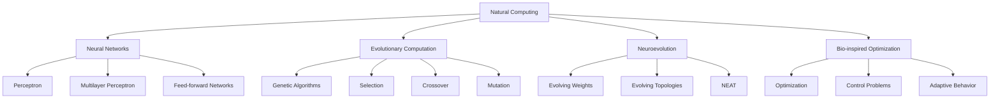
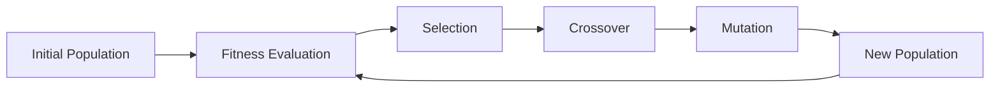

# 🌿 Natural Computing Projects


A collection of educational and experimental projects focused on **Natural Computing**, including neural networks, genetic algorithms, neuroevolution, NEAT, and biologically inspired computational models.

This repository explores how ideas inspired by nature can be used to solve computational problems, optimize systems, train models, and simulate adaptive behavior.

The main goal is not only to use ready-made libraries, but also to understand how these algorithms work internally through simple, readable, and educational implementations.

---

## 📌 Overview

**Natural Computing** is a field of Computer Science that studies computational models inspired by natural phenomena.

Instead of designing algorithms only from rigid mathematical rules, Natural Computing investigates how biological, physical, evolutionary, and collective systems can inspire computational problem solving.

Examples include:

* The brain inspiring **Artificial Neural Networks**
* Natural evolution inspiring **Genetic Algorithms**
* Biological adaptation inspiring **Neuroevolution**
* Swarms of insects inspiring **Swarm Intelligence**
* Immune systems inspiring **Artificial Immune Systems**
* Natural self-organization inspiring **Artificial Life**

This repository currently focuses mainly on:

* Neural Networks
* Genetic Algorithms
* Neuroevolution
* NEAT
* Evolutionary Computation
* Bio-inspired optimization
* Machine Learning experiments
* Classic control environments
* Educational implementations from scratch

---

## 🖼️ Illustrative Images

### Artificial Neural Network


Image source: [Wikimedia Commons — Artificial neural network.svg](https://commons.wikimedia.org/wiki/File:Artificial_neural_network.svg)

---

### Metaheuristics and Evolutionary Algorithms


Image source: [Wikimedia Commons — Metaheuristics classification.svg](https://commons.wikimedia.org/wiki/File:Metaheuristics_classification.svg)

---

### Fully Connected Neural Network


Image source: [Wikimedia Commons — Fully connected neural network.svg](https://commons.wikimedia.org/wiki/File:Fully_connected_neural_network.svg)

---

## 🧭 Conceptual Map



---

## 📁 Repository Structure

```text
Natural-Computing-Projects/
├── Evolutionary_Neural_Networks/
│   ├── train_mlp_binary_classifier.py
│   ├── train_mlp_iris_classifier.py
│   ├── train_neat_binary_classifier.py
│   ├── train_neat_iris_classifier.py
│   ├── neuroevolution_binary_classifier.py
│   ├── neuroevolution_iris_classifier.py
│   ├── evolve_mountain_car_actions.py
│   ├── evolve_acrobot_actions.py
│   └── README.md
│
├── Neural_Network/
│   ├── perceptron_implementation.py
│   ├── feed_forward_network.py
│   ├── mlp_training_examples.py
│   └── README.md
│
└── README.md
```

---

## 🧬 Evolutionary Neural Networks

The `Evolutionary_Neural_Networks/` folder contains experiments combining genetic algorithms, neural networks, NEAT, and neuroevolution.

It includes:

* Custom genetic algorithm implementation
* Feed-forward neural network implementation
* NEAT classifiers
* Iris classification experiments
* Binary classification experiments
* Neuroevolution with custom chromosomes
* Genetic action evolution for Gym/Gymnasium environments

Main topics:

```text
Genetic Algorithms
Neuroevolution
NEAT
Feed-forward Neural Networks
Evolutionary Optimization
Gym Classic Control
```

Example scripts:

```text
train_mlp_binary_classifier.py
train_mlp_iris_classifier.py
train_neat_binary_classifier.py
train_neat_iris_classifier.py
neuroevolution_binary_classifier.py
neuroevolution_iris_classifier.py
evolve_mountain_car_actions.py
evolve_acrobot_actions.py
```

This folder studies how a population of candidate solutions can evolve over time until better neural models, action policies, or classifiers emerge.

---

## 🧠 Neural Network

The `Neural_Network/` folder contains implementations and experiments focused on neural network models.

It includes scripts related to:

* Perceptron
* Multilayer Perceptron
* Feed-forward networks
* Supervised learning
* Dataset loading
* Training loops
* Classification experiments

This folder is more focused on the basic structure of neural networks before combining them with evolutionary techniques.

---

## 🧮 Mathematical Background

### Perceptron

A perceptron receives an input vector:

$$
x = [x_1, x_2, \dots, x_n]
$$

and computes a weighted sum:

$$
z = w^T x + b
$$

where:

* $w$ is the weight vector
* $x$ is the input vector
* $b$ is the bias
* $z$ is the linear activation value

The final output is produced by an activation function:

$$
\hat{y} = \phi(z)
$$

For binary classification, a common step activation is:

$$
\phi(z) =
\begin{cases}
1, & z \geq 0 \
0, & z < 0
\end{cases}
$$

---

### Feed-forward Neural Networks

For a multilayer neural network, each layer computes:

$$
a^{(l)} = \sigma\left(W^{(l)}a^{(l-1)} + b^{(l)}\right)
$$

where:

* $a^{(l)}$ is the activation of layer $l$
* $W^{(l)}$ is the weight matrix of layer $l$
* $b^{(l)}$ is the bias vector
* $\sigma$ is the activation function

For a network with layer sizes:

$$
L_0, L_1, L_2, \dots, L_n
$$

the number of weights is approximately:

$$
\sum_{i=0}^{n-1} L_iL_{i+1}
$$

---

### Genetic Algorithms

A genetic algorithm evolves a population of candidate solutions.

A candidate solution is usually represented as a chromosome:

$$
c = [g_1, g_2, \dots, g_m]
$$

where each $g_i$ is a gene.

The optimization objective is to find a chromosome that maximizes a fitness function:

$$
c^* = \arg\max_{c \in P} f(c)
$$

where:

* $P$ is the population
* $f(c)$ is the fitness of chromosome $c$
* $c^*$ is the best candidate found

The basic evolutionary cycle is:



---

### Neuroevolution

In neuroevolution, an evolutionary algorithm is used to optimize neural networks.

Depending on the encoding strategy, the chromosome may represent:

* Neural network weights
* Neural network biases
* Network architecture
* Activation functions
* Full policies for control tasks
* Action sequences for environments

A simple chromosome encoding neural network parameters can be represented as:

$$
c = [w_1, w_2, \dots, w_k, b_1, b_2, \dots, b_j]
$$

The fitness can be defined using classification accuracy:

$$
f(c) = \frac{\text{correct predictions}}{\text{total samples}}
$$

or using environment reward:

$$
f(c) = \sum_{t=0}^{T} r_t
$$

where $r_t$ is the reward received at time step $t$.

---

### NEAT

**NEAT** stands for **NeuroEvolution of Augmenting Topologies**.

Unlike simple neuroevolution methods that evolve only weights, NEAT evolves both:

* Connection weights
* Neural network topology

In NEAT, genomes can grow over time through structural mutations such as:

* Adding a new connection
* Adding a new node
* Mutating connection weights
* Enabling or disabling genes

A simplified compatibility distance between two genomes can be written as:

$$
\delta =
\frac{c_1E}{N}
+
\frac{c_2D}{N}
+
c_3\overline{W}
$$

where:

* $E$ is the number of excess genes
* $D$ is the number of disjoint genes
* $\overline{W}$ is the average weight difference
* $N$ normalizes genome size
* $c_1$, $c_2$, and $c_3$ are coefficients

This distance helps NEAT separate genomes into species, preserving diversity during evolution.

---

## 🚀 How to Run

Clone the repository:

```bash
git clone https://github.com/fobos123deimos/Natural-Computing-Projects.git
cd Natural-Computing-Projects
```

Create a virtual environment:

```bash
python -m venv .venv
```

Activate it on Linux/macOS:

```bash
source .venv/bin/activate
```

Activate it on Windows:

```bash
.venv\Scripts\activate
```

Install the main dependencies:

```bash
pip install numpy matplotlib neat-python graphviz gymnasium
```

Run a script from the repository root:

```bash
python Evolutionary_Neural_Networks/train_mlp_binary_classifier.py
```

or:

```bash
python Evolutionary_Neural_Networks/train_neat_iris_classifier.py
```

Some scripts may require specific datasets or configuration files inside their own folders.

---

## 📦 Main Dependencies

### Python Libraries

| Library        | Purpose                                                          |
| -------------- | ---------------------------------------------------------------- |
| `numpy`        | Matrix operations, vectors, numerical computing                  |
| `matplotlib`   | Plotting fitness curves, classification results, and experiments |
| `neat-python`  | NEAT implementation for neuroevolution                           |
| `graphviz`     | Visualization of evolved neural network structures               |
| `gymnasium`    | Classic control environments such as MountainCar and Acrobot     |
| `scikit-learn` | Dataset utilities, metrics, and comparison models                |
| `pandas`       | Dataset loading and tabular data manipulation                    |
| `deap`         | Evolutionary computation framework                               |
| `pygad`        | Genetic algorithm experiments in Python                          |

Optional installation:

```bash
pip install scikit-learn pandas deap pygad
```

---

### C++ Libraries Related to Natural Computing

Although this repository is mainly written in Python, similar ideas can also be implemented efficiently in C++.

| Library        | Language | Purpose                                                      |
| -------------- | -------: | ------------------------------------------------------------ |
| Eigen          |      C++ | Linear algebra, matrices, vectors, numerical solvers         |
| Armadillo      |      C++ | Scientific computing and matrix-based algorithms             |
| mlpack         |      C++ | Machine learning algorithms with bindings to other languages |
| dlib           |      C++ | Machine learning, optimization, and numerical tools          |
| pagmo2         |      C++ | Parallel optimization and metaheuristics                     |
| EO / ParadisEO |      C++ | Evolutionary computation and metaheuristic optimization      |

---

### Other Languages and Ecosystems

| Library / Framework |     Language | Purpose                                                  |
| ------------------- | -----------: | -------------------------------------------------------- |
| Flux.jl             |        Julia | Neural networks and differentiable programming           |
| MLJ.jl              |        Julia | Machine learning workflows                               |
| Smile               | Java / Scala | Machine learning, classification, regression, clustering |
| DJL                 |         Java | Deep learning toolkit                                    |
| TensorFlow.js       |   JavaScript | Neural networks and machine learning in JavaScript       |
| ml5.js              |   JavaScript | Friendly machine learning library built on TensorFlow.js |
| Rust ndarray        |         Rust | N-dimensional arrays for numerical computing             |
| Linfa               |         Rust | Machine learning toolkit inspired by scikit-learn        |

---

## 🧪 Datasets

Some experiments use classic small datasets, such as:

* Binary admission dataset
* Iris dataset
* Three-feature binary dataset

These datasets are useful for educational experiments because they are small enough to inspect manually, but still useful for testing classification models.

The Iris dataset, for example, contains measurements from three classes of iris plants and is commonly used in classification experiments.

---

## 🕹️ Classic Control Experiments

Some scripts evolve actions or policies for classic control environments.

Examples:

```text
MountainCar
Acrobot
CartPole
Pendulum
```

In this type of experiment, the algorithm does not simply minimize a classification error. Instead, it tries to maximize a reward signal:

$$
R = \sum_{t=0}^{T} r_t
$$

The chromosome may represent:

* A sequence of actions
* A simple decision policy
* Parameters of a controller
* Weights of a neural network policy

---

## ⏱️ Complexity Overview

### Feed-forward Neural Networks

For a network with layer sizes:

$$
L_0, L_1, L_2, \dots, L_n
$$

the approximate feed-forward cost is:

$$
O\left(\sum_{i=0}^{n-1} L_iL_{i+1}\right)
$$

The memory cost for the weights is also:

$$
O\left(\sum_{i=0}^{n-1} L_iL_{i+1}\right)
$$

---

### Genetic Algorithms

For:

```text
P = population size
C = chromosome length
G = number of generations
```

the approximate cost is:

$$
O(G \cdot P \cdot C)
$$

The real cost may be higher depending on how expensive the fitness evaluation is.

---

### Neuroevolution

For:

```text
P = population size
N = number of samples
C = chromosome length
G = number of generations
```

the approximate cost is:

$$
O(G \cdot P \cdot N \cdot C)
$$

This can be expensive because each chromosome needs to be evaluated over multiple samples.

---

### NEAT

NEAT evolves both connection weights and network topology.

A simplified cost estimate is:

$$
O(G \cdot P \cdot N \cdot E)
$$

where:

```text
G = number of generations
P = population size
N = number of samples
E = average number of enabled connections per genome
```

Since NEAT networks can grow over time, $E$ is not always constant.

---

## 📊 Complexity Summary

| Method               | Main Cost                     |     Approximate Time Complexity | Approximate Space Complexity |
| -------------------- | ----------------------------- | ------------------------------: | ---------------------------: |
| Perceptron           | Dot product                   |                         $O(Nd)$ |                       $O(d)$ |
| Feed-forward MLP     | Matrix multiplications        | $O(\sum L_iL_{i+1})$ per sample |         $O(\sum L_iL_{i+1})$ |
| Genetic Algorithm    | Population evaluation         |                        $O(GPC)$ |                      $O(PC)$ |
| Neuroevolution       | Fitness over samples          |                       $O(GPNC)$ |                      $O(PC)$ |
| NEAT                 | Evaluation of evolving graphs |                       $O(GPNE)$ |                      $O(PE)$ |
| Gym action evolution | Environment simulation        |                        $O(GPT)$ |                      $O(PC)$ |

Where:

```text
N = number of samples
d = number of features
G = generations
P = population size
C = chromosome length
T = episode length
E = enabled connections
L_i = number of neurons in layer i
```

---

## 🧠 Learning Goals

This repository was created to study and experiment with:

* How neural networks process data
* How perceptrons classify simple patterns
* How multilayer networks represent nonlinear functions
* How genetic algorithms evolve candidate solutions
* How chromosomes can encode weights, actions, or neural structures
* How NEAT evolves both weights and topology
* How fitness functions guide evolutionary search
* How natural processes can inspire computational problem solving
* How different learning strategies compare in simple classification tasks

---

## 🧱 Implementation Philosophy

This repository prioritizes learning over abstraction.

Some implementations are intentionally written from scratch to make the internal logic more visible, even when libraries could provide more optimized versions.

The code may include:

* Older exploratory scripts
* Refactored English versions
* Custom algorithm implementations
* Visualization utilities
* Dataset-specific experiments
* Simple training loops
* Experimental file organization

The goal is to make the algorithms understandable before making them industrial-grade.

---

## 🧪 Example Experiment Ideas

Possible experiments to add in the future:

* Compare MLP training by gradient descent versus genetic algorithms
* Evolve neural network weights for Iris classification
* Use NEAT to solve XOR
* Use NEAT to solve CartPole
* Compare fixed-topology neuroevolution with topology-evolving NEAT
* Plot best fitness and average fitness per generation
* Visualize evolved neural network graphs
* Add mutation rate sensitivity experiments
* Add crossover strategy comparisons
* Implement elitism and tournament selection variants

---

## 📈 Suggested Results Section

A future version of this repository can include tables like:

| Experiment        | Algorithm         | Dataset / Environment |   Metric | Result |
| ----------------- | ----------------- | --------------------- | -------: | -----: |
| Binary classifier | MLP               | Binary dataset        | Accuracy |    TBD |
| Iris classifier   | MLP               | Iris                  | Accuracy |    TBD |
| Iris classifier   | NEAT              | Iris                  | Accuracy |    TBD |
| MountainCar       | Genetic Algorithm | Gymnasium             |   Reward |    TBD |
| Acrobot           | Genetic Algorithm | Gymnasium             |   Reward |    TBD |

And plots such as:

```text
docs/images/mlp-loss-curve.png
docs/images/ga-best-fitness.png
docs/images/neat-fitness-evolution.png
docs/images/gym-reward-curve.png
```

---

## 🧹 Refactoring Notes

Current organization goals:

* Improve file names
* Standardize English naming conventions
* Separate datasets from source code
* Add configuration files for experiments
* Add reusable modules
* Add unit tests
* Improve README files in subfolders
* Add generated plots and diagrams
* Document each experiment individually

Recommended future structure:

```text
Natural-Computing-Projects/
├── docs/
│   └── images/
├── data/
│   ├── binary/
│   └── iris/
├── natural_computing/
│   ├── neural_networks/
│   ├── genetic_algorithms/
│   ├── neat/
│   └── visualization/
├── experiments/
│   ├── classification/
│   └── control/
├── tests/
├── requirements.txt
└── README.md
```

---

## 🖼️ Image Credits and Licenses

| Image                          | Author / Source                                  | License                   | Link                                                                                    |
| ------------------------------ | ------------------------------------------------ | ------------------------- | --------------------------------------------------------------------------------------- |
| Artificial Neural Network      | Cburnett / Wikimedia Commons                     | GFDL or CC BY-SA 3.0      | [File page](https://commons.wikimedia.org/wiki/File:Artificial_neural_network.svg)      |
| Metaheuristics Classification  | Johann Dréo and Caner Candan / Wikimedia Commons | GFDL, CC BY-SA, or CeCILL | [File page](https://commons.wikimedia.org/wiki/File:Metaheuristics_classification.svg)  |
| Fully Connected Neural Network | Raquel Garrido Alhama / Wikimedia Commons        | CC BY-SA 4.0              | [File page](https://commons.wikimedia.org/wiki/File:Fully_connected_neural_network.svg) |

---

## 📚 References

| Topic                               | Reference                                                                           | Type               | Link                                                                                                            |
| ----------------------------------- | ----------------------------------------------------------------------------------- | ------------------ | --------------------------------------------------------------------------------------------------------------- |
| Genetic Algorithms                  | Melanie Mitchell — *An Introduction to Genetic Algorithms*                          | Book               | [MIT Press](https://mitpress.mit.edu/9780262631853/an-introduction-to-genetic-algorithms/)                      |
| Artificial Intelligence             | Stuart Russell and Peter Norvig — *Artificial Intelligence: A Modern Approach*      | Book               | [Official AIMA website](https://aima.cs.berkeley.edu/)                                                          |
| Neural Networks                     | Simon Haykin — *Neural Networks and Learning Machines*                              | Book               | [Google Books](https://books.google.com/books/about/Neural_Networks_and_Learning_Machines.html?id=KCwWOAAACAAJ) |
| Bio-inspired AI                     | Dario Floreano and Claudio Mattiussi — *Bio-Inspired Artificial Intelligence*       | Book               | [MIT Press](https://mitpress.mit.edu/9780262062718/bio-inspired-artificial-intelligence/)                       |
| NEAT                                | Stanley and Miikkulainen — *Evolving Neural Networks through Augmenting Topologies* | Paper              | [Official PDF](https://nn.cs.utexas.edu/downloads/papers/stanley.ec02.pdf)                                      |
| NEAT                                | NEAT-Python documentation                                                           | Documentation      | [Read the Docs](https://neat-python.readthedocs.io/)                                                            |
| Datasets                            | UCI Machine Learning Repository — Iris Dataset                                      | Dataset            | [UCI Iris](https://archive.ics.uci.edu/dataset/53/iris)                                                         |
| Reinforcement Learning Environments | Gymnasium Classic Control                                                           | Documentation      | [Gymnasium](https://gymnasium.farama.org/environments/classic_control/)                                         |
| Python ML                           | scikit-learn MLPClassifier                                                          | Documentation      | [scikit-learn](https://scikit-learn.org/stable/modules/generated/sklearn.neural_network.MLPClassifier.html)     |
| Evolutionary Computation            | DEAP                                                                                | Python Library     | [DEAP Docs](https://deap.readthedocs.io/)                                                                       |
| Genetic Algorithms                  | PyGAD                                                                               | Python Library     | [PyGAD Docs](https://pygad.readthedocs.io/en/latest/)                                                           |
| Numerical Computing                 | NumPy                                                                               | Python Library     | [NumPy Docs](https://numpy.org/doc/)                                                                            |
| Plotting                            | Matplotlib                                                                          | Python Library     | [Matplotlib Docs](https://matplotlib.org/stable/)                                                               |
| Graph Visualization                 | Graphviz                                                                            | Tool               | [Graphviz](https://graphviz.org/)                                                                               |
| Linear Algebra                      | Eigen                                                                               | C++ Library        | [Eigen](https://libeigen.gitlab.io/)                                                                            |
| Scientific Computing                | Armadillo                                                                           | C++ Library        | [Armadillo](https://arma.sourceforge.net/)                                                                      |
| Machine Learning                    | mlpack                                                                              | C++ Library        | [mlpack](https://www.mlpack.org/)                                                                               |
| Machine Learning                    | dlib                                                                                | C++ Library        | [dlib](https://dlib.net/)                                                                                       |
| Parallel Optimization               | pagmo2                                                                              | C++ Library        | [pagmo2](https://esa.github.io/pagmo2/)                                                                         |
| Evolutionary Computation            | EO / ParadisEO                                                                      | C++ Framework      | [ParadisEO](https://nojhan.github.io/paradiseo/)                                                                |
| Julia ML                            | Flux.jl                                                                             | Julia Library      | [Flux](https://fluxml.ai/)                                                                                      |
| Java ML                             | Deep Java Library                                                                   | Java Library       | [DJL](https://djl.ai/)                                                                                          |
| JavaScript ML                       | TensorFlow.js                                                                       | JavaScript Library | [TensorFlow.js](https://www.tensorflow.org/js)                                                                  |
| Rust ML                             | Linfa                                                                               | Rust Library       | [Linfa](https://github.com/rust-ml/linfa)                                                                       |

---

## 📝 Status

This repository is under active organization and refactoring.

The current focus is improving:

* File names
* Folder organization
* Documentation
* Code readability
* English naming conventions
* Consistency across neural network and genetic algorithm experiments
* Reproducibility of experiments
* Visualization of results

---

## ✅ Summary

This repository is a practical study space for understanding **Natural Computing** through code.

It connects concepts from biology, evolution, neural computation, optimization, and adaptive systems, using small experiments that make each idea easier to inspect and modify.

The main emphasis is:

```text
Understand first.
Optimize later.
Experiment always.
```
